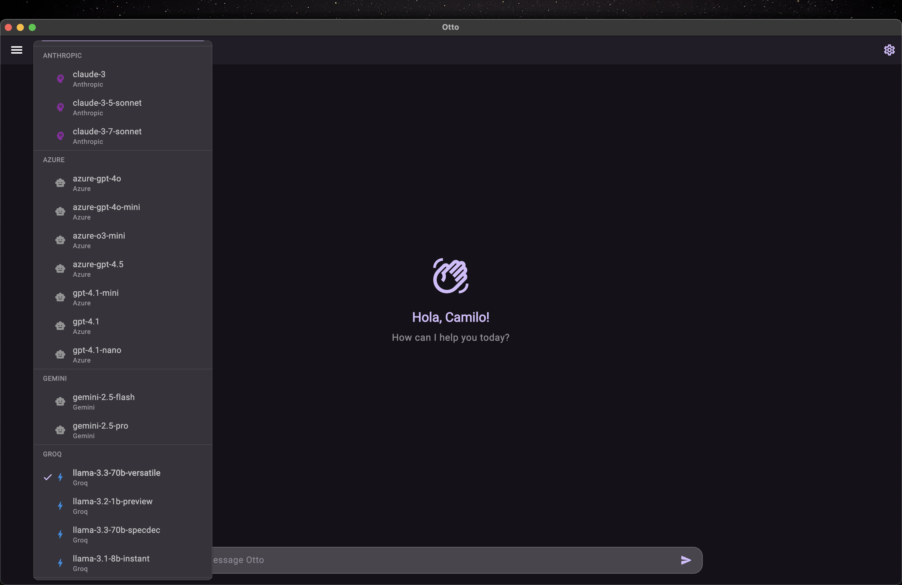

# Otto 🤘✨

Your *private* & *flexible* AI chat companion. (Basically, your new digital bestie!)

## 🤔 What's Otto?

Otto is your secure gateway to the wild world of Large Language Models (LLMs). Built with Flutter (you know, that magic UI stuff), it's a cross-platform chatbot service designed with privacy and *you* in mind.



Here's the lowdown:

*   🔒 **Talk Privately:** Your conversations are end-to-end encrypted. Seriously, keep your secrets safe. What you chat about stays between you and the AI.
*   🔄 **Switch it Up:** Seamlessly switch between different LLMs like a DJ changing tracks. Mix and match cloud providers (like Gemini, OpenAI, Anthropic, etc.), or even run models locally on your own machine. Otto handles the messy bits.
*   ⚙️ **Fine-Tune Control:** Get granular control over advanced LLM parameters (temperature, top-p, etc.). Go ahead, channel your inner mad scientist!
*   👀 **See Your Context:** Visually manage the conversation's context window. No more guessing what the AI remembers!
*   💾 **Your Chats, Your Data:** Manage all your conversations privately and securely. It's *your* data, after all.

Under the hood, there's a trusty Python backend (`backend/mongython`), powered by MongoDB and LiteLLM, helping to keep the gears turning smoothly. ⚙️🐍

## 🚀 Key Features

*   📱💻🌍 **Truly Cross-Platform:** Runs beautifully on Android, iOS, Web, macOS, Windows, and Linux thanks to Flutter. Like, *everywhere*. No device left behind!
*   💅 **Slick UI:** Designed to be intuitive and genuinely pleasant to use. No ugly apps allowed here.
*   🛡️ **End-to-End Encryption:** Your privacy isn't an afterthought, it's the main event.
*   🔌 **Flexible LLM Integration:** Connect to various cloud LLMs or run local models. Ultimate freedom!
*   🎛️ **Advanced Parameter Controls:** Tweak settings to get the *perfect* response. Unleash the AI's potential!
*   📊 **Visual Context Management:** Understand and manage your chat history like a pro.
*   🔐 **Private Conversation Storage:** Keep your chat history secure and private, just the way it should be.

## 🎉 Getting Started

Ready to dive in? Let's go!

1.  **Clone the Repo:**
    ```bash
    git clone https://github.com/camilovelezr/otto.git
    cd otto/otto
    ```
2.  **Install Dependencies:** (Grab a coffee, this might take a sec ☕)
    ```bash
    flutter pub get
    ```
3.  **Run the App:**
    ```bash
    flutter run
    ```
    *(Pick your weapon! 📱💻)*
4.  **Backend Setup:** Need the full backend experience? You'll need to set that up separately. Adventure awaits in the `backend/` directory! 🧭
